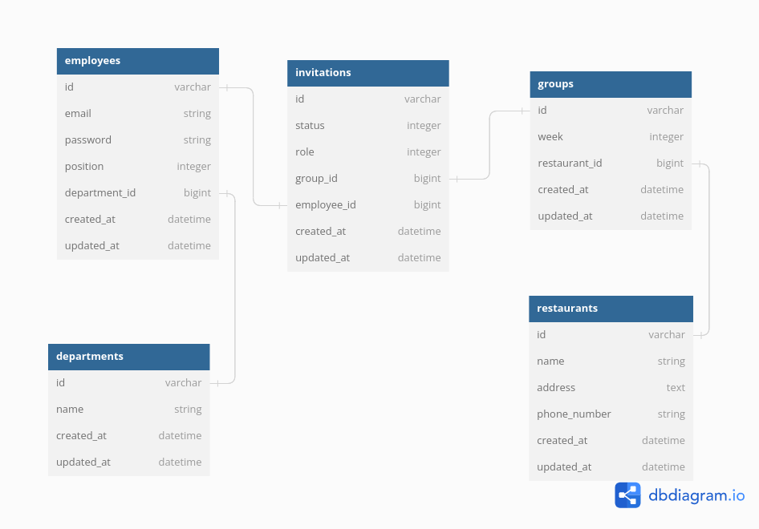

# BlindDate

Welcome to BlindDate App!

This is a simple app to create groups of employees and invite them to lunch every week.

# Table of Contents

- [How it works](#how-it-works)
- [Getting Started](#getting-started)
    - [Dockerized](#dockerized)
    - [Using Bash Script](#using-bash-script)
      - [Prerequisites](#prerequisites)
      - [Installation](#installation)
    - [API Documentation](#api-documentation)
    - [Test API with Postman](#test-api-with-postman)
    - [API Test](#api-test)
    - [Test cases](#test-cases)
    - [Test Coverage](#test-coverage)
    - [Design](#design)
      - [ERD](#erd)
      - [Architecture](#architecture)
    - [Email Preview](#email-preview)
    - [List of Features](#list-of-features)
    - [Improvement](#improvement)

## How it works

1. Every monday a cron job runs and Create random groups from employees from different departments
2. Send email to all employees in group and invite employees to lunch
3. Then every Thursday another cron job runs and pick a random leader
4. Leader can choose a restaurant from list of restaurants (API for this not Implemented yet)

To see full list of features please see [List of Features](#list-of-features)

## Getting Started

### Dockerized

In case of production run assign master key value for production environment:

```bash
EDITOR="nano" bin/rails credentials:edit --environment production
```

Run compose command to build Images:

```bash
docker-compose build
```

Then Run up command to start containers:

```bash
docker-compose up
```

To run in daemonize state:

```base
docker-compose up -d
```

This will create images and runs containers and you can access app from `http://localhost:3000`

If you want faster setup in development to test it out, Please follow Below setup using Bash script.

### Using Bash Script

#### Prerequisites

- Ruby v3.2.2
- Rails v7.0.6
- Redis > v6

#### Installation

Give executable privilege to script:

```bash
sudo chmod +x setup.sh
```

Then Run application setup:

```bash
./setup.sh app
```

In case of prevent any error please set enter database credentials and script will set environment variable automatically

If you still face error, Please set your postgres database config in the `.env` file in the root directory if you have any database connection problem. (also its possible to set variables in your shell env)

     DATABASE_HOST=<your db host>
     DATABASE_PORT=<your db port>
     DATABASE_USERNAME=<your db username>
     DATABASE_PASSWORD=<your db password>

Note. if your config is ok and you face peer connection error, check your postgres [configuration](https://www.postgresql.org/docs/current/auth-pg-hba-conf.html)

### API Documentation

documentation for API can be found [HERE](https://documenter.getpostman.com/view/17723125/2s9XxtyFZo)

### Test API with Postman

To test API with postman, Please Visit online List [HERE](https://www.postman.com/flight-operator-43069002/workspace/blinddate/documentation/17723125-c9038614-7faa-465e-b9f5-5c43514ba9e6)

### API Test

Please use Postman to test API

In order to test api via online postman you need to expose local system to internet using ngrok or other tools, also its possible to export and import it locally.

### Test cases

Application is written in TDD approach and tests are written in Rspec.

In CI tests are running, in case of local test you can run:

```bash
rspec
```

### Test Coverage

After running test you can see coverage report in `coverage` directory

## Design

### ERD



### Architecture

- Services: system uses service layer to handle business logic
- Serializers: system serializer to handle json response using entity relationships base on JSON API specification

## Email Preview

In order to seed how would be invitation email look like see: [Email Preview](http://localhost:3000/rails/mailers/invitation_mailer/send_invitation.html?locale=en)

## List of Features

- [x] Create Group with 4 employee from different departments
- [x] Send Invitation Email to all employees in group 
- [x] Every monday cron job runs and invite employees
- [x] Every Thursday another cron job runs and pick a random leader
- [x] There is list of Restaurant to choose from
- [x] Invited employees can accept or reject invitation
- [x] Employee selection is completely random
- [x] There is limitation to invite employees to group between 3 to 5
- [x] Its possible to create group with 3 to 5 employees manually
- [x] System return list of groups for given week

### Improvement
- Add Reverse proxy to keep origin server safe
- Endpoint to add Employee
- repository pattern can be used to handle complex database operations
- Add User Authentication to protect app
- Add Access Management to Authorize users with libraries Pundit
- Can push Image to Registery using CI
- Script to destroy app and data in filesystem and database can be added
- And Features like Infra to automate resource provisioning
- Add Decorator for better presentation in complex views
